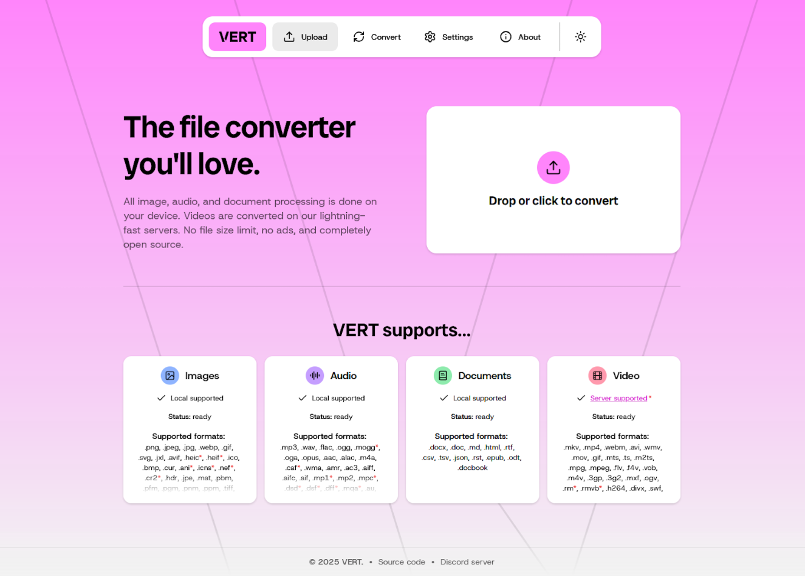
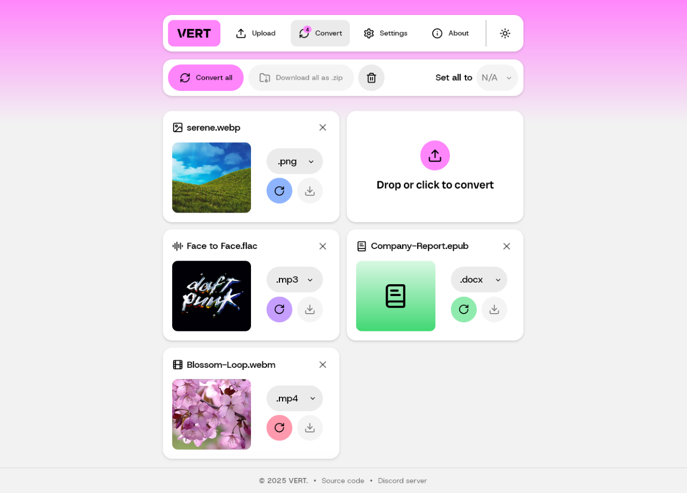

  

<h1 align="center"><a href="https://filetools.app">FileTools.app</a></h1>

FileTools is a file conversion utility that uses WebAssembly to convert files on your device instead of a cloud. Check out the live instance at [filetools.app](https://filetools.app).

FileTools is built in Svelte and TypeScript.

## Screenshots

|                     Upload page                      |                     Conversion page                      |
| :--------------------------------------------------: | :------------------------------------------------------: |
|  |  |

## Features

- Convert files directly on your device using WebAssembly\*
- No file or file size limits
- Convert images, audio, documents, and video\*
- Supports over **250+** file formats
- Conversion settings
- User-friendly interface built with Svelte

\* Non-local video conversion is available with our official instance, but the [daemon](https://github.com/filetools/filetoolsd) is easily self-hostable to maintain privacy and fully local functionality.

## Documentation

- [FAQ](./docs/FAQ.md)
- [Getting Started](./docs/GETTING_STARTED.md)
- [Using Docker](./docs/DOCKER.md)
- [Video Conversion](./docs/VIDEO_CONVERSION.md)

## License

This project is licensed under the AGPL-3.0 License, please see the [LICENSE](LICENSE) file for details.

## Star History

<a href="https://www.star-history.com/#filetools/FileTools&Date">
 <picture>
   <source media="(prefers-color-scheme: dark)" srcset="https://api.star-history.com/svg?repos=filetools/FileTools&type=Date&theme=dark" />
   <source media="(prefers-color-scheme: light)" srcset="https://api.star-history.com/svg?repos=filetools/FileTools&type=Date" />
   
 </picture>
</a>
